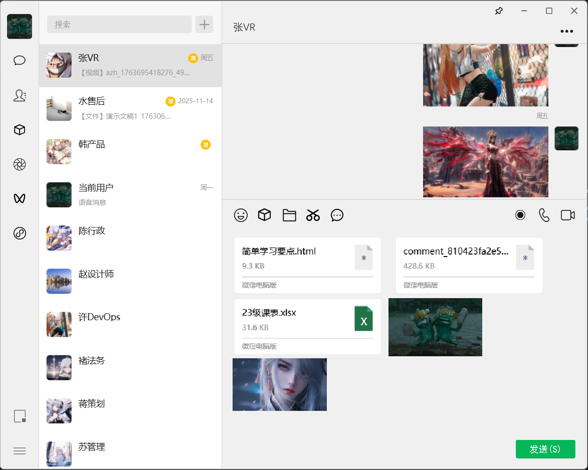
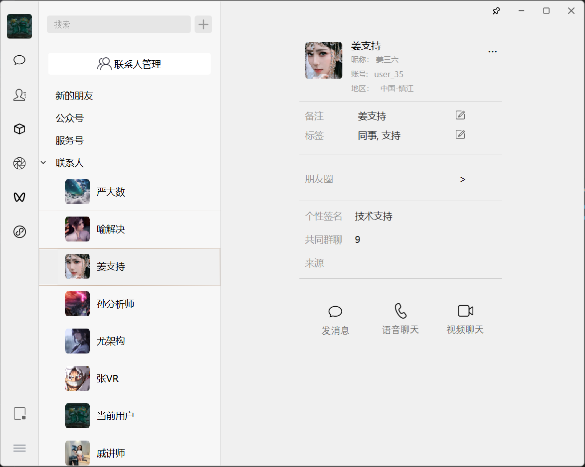
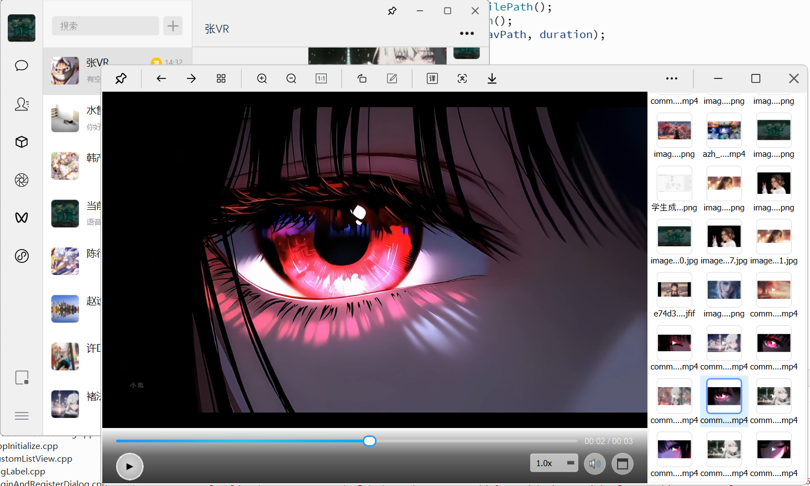

# 模仿微信的聊天软件
QT开发客户端，（目前还没做后端）。具备方式文本信息、图片信息、视频信息、文件信息、语音信息等功能。本地持久化使用SQLite。
### 客户端架构
```
[UI模块] <-------------------------> [控制模块]
                                          |
          +------------------------------+-----------------------------+
          |                              |                             |
[网络模块（WebSocket）]        [存储模块（SQLite）]             [媒体处理模块]
          |                              |                             |
[与服务端通信]                        [本地消息缓存]           [生成视频或图片等缩略图..]
```


## 测试截图
### 截图1


### 截图2


| 截图3 | 截图4 |
|-------|-------|
|  |  |

## 二、演示视频
<video width="800" height="450" controls>
  <source src="docs/testImage/test.mp4" type="video/mp4">
  你的浏览器不支持 HTML5 视频播放，请下载视频查看：<a href="docs/testImage/test.mp4">test.mp4</a>
</video>

<a href="docs/testImage/test.mp4">
  
</a>
> 点击封面查看演示视频
